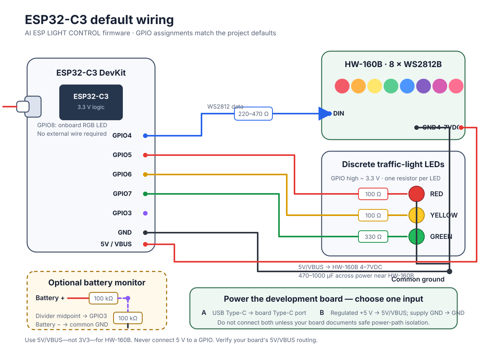

# AI ESP LIGHT CONTROL · Firmware

The ESP32-C3 BLE firmware for AI ESP LIGHT CONTROL. It controls a WS2812B RGB board and independent red, yellow, and green traffic lights, and works with the companion [Desktop app](https://github.com/easyreactuse/ai-esp-light-control-desktop) to turn Codex task status into physical light signals.

> [Desktop app](https://github.com/easyreactuse/ai-esp-light-control-desktop) · [Complete BLE JSON protocol](BLE_COMMANDS.md)

## Features

- HW-160B with eight WS2812B LEDs: solid color, blink, rainbow chase, and synchronized color flow
- Red, yellow, and green traffic lights: any combination of steady, synchronized blinking, and PWM breathing
- Independent RGB and traffic-light outputs, with optional atomic updates through a JSON array
- BLE Write, Write Without Response, Read, and Notify
- Optional battery-voltage monitoring with a low-battery warning on the onboard RGB LED
- Configurable GPIO pins, BLE device name, and battery thresholds through `menuconfig`

## Hardware and default pins

The current target is **ESP32-C3**. The project uses NimBLE and does not use Classic Bluetooth.

| Function | Default GPIO |
|---|---:|
| HW-160B `DIN` | GPIO4 |
| Red traffic light | GPIO5 |
| Yellow traffic light | GPIO6 |
| Green traffic light | GPIO7 |
| Onboard RGB LED | GPIO8 |
| Optional battery ADC | GPIO3 |



GPIO8 is the onboard RGB pin on many ESP32-C3 DevKit boards. Some boards have no onboard RGB LED or use a different pin. Change it under `idf.py menuconfig` → **RGB light controller configuration**.

### Power

Power the ESP32-C3 development board using **one** of these inputs:

- Connect USB Type-C to the development board; its `5V`/`VBUS` pin then provides the USB 5 V rail to the HW-160B.
- Connect a regulated external 5 V supply to the development board's `5V`/`VBUS` pin and `GND`.

Do not connect USB Type-C and an external 5 V input at the same time unless the specific development board documents safe power-path isolation. Pin labels and USB power routing vary between boards, so verify the board schematic before using `5V`/`VBUS` as an input or output. The supply and USB cable must be able to handle the ESP32-C3 and LED current together.

Use the `5V`/`VBUS` pin—not `3V3`—for the HW-160B `4-7VDC` input. The traffic-light LEDs are driven from 3.3 V GPIO through their individual current-limiting resistors. All grounds must be connected together.

### Discrete traffic-light LEDs

The default circuit uses active-high outputs. A selected GPIO outputs approximately 3.3 V. The documented build uses 100 Ω resistors for red and yellow, and 330 Ω for green.

```text
GPIO5 (3.3 V high) ── 100 Ω ── red LED anode       red LED cathode ── GND
GPIO6 (3.3 V high) ── 100 Ω ── yellow LED anode    yellow LED cathode ── GND
GPIO7 (3.3 V high) ── 330 Ω ── green LED anode     green LED cathode ── GND
```

A traffic-light module must accept 3.3 V logic. Use a transistor or MOSFET driver for loads that draw more current than an ESP32 GPIO can safely supply.

### HW-160B wiring

| HW-160B | Connection |
|---|---|
| `DIN` | ESP32 GPIO4, preferably through a 220–470 Ω series resistor |
| `4-7VDC` | ESP32 development board `5V`/`VBUS` pin |
| Either `GND` | ESP32 development board `GND` |
| `DOUT` | Leave open unless another board is chained |

Place a 470–1000 µF electrolytic capacitor across the HW-160B power input. If the data wire is long or the LEDs behave erratically, add a `74AHCT125` or similar 3.3 V-to-5 V level shifter between GPIO4 and `DIN`. Never connect an ESP32 GPIO directly to 5 V.

## Quick start

Install and activate an ESP-IDF environment first.

```bash
git clone https://github.com/easyreactuse/ai-esp-light-control-firmware.git
cd ai-esp-light-control-firmware
idf.py set-target esp32c3
idf.py build
idf.py -p /dev/cu.usbmodem1101 flash monitor
```

Replace the serial device with the correct port on your computer. If the tool still reports a chip-target mismatch, run `idf.py fullclean`, set the ESP32-C3 target again, and rebuild. Press `Ctrl+]` to leave the monitor.

## BLE control

| Item | Value |
|---|---|
| Advertised name | `ESP-TRAFFIC-LIGHT` |
| Service UUID | `7b9a0001-6d4f-4f4b-9f2a-1c5e7a3d1000` |
| Characteristic UUID | `7b9a0002-6d4f-4f4b-9f2a-1c5e7a3d1000` |
| Payload | UTF-8 JSON, up to 255 bytes |

This example starts RGB color flow and blinks the yellow traffic light at the same time:

```json
[{"output":"8_BIT_RGB","cmd":"flow","brightness":25,"speed":25},{"output":"TRAFFIC_LIGHT","light":["YELLOW"],"brightness":60,"blink_ms":500}]
```

See [BLE_COMMANDS.md](BLE_COMMANDS.md) for every command, parameter range, response, and example. nRF Connect or LightBlue is useful for temporary testing. For everyday control and Codex status automation, use [AI ESP LIGHT CONTROL Desktop](https://github.com/easyreactuse/ai-esp-light-control-desktop).

## Optional low-battery monitoring

The ESP32 cannot infer battery voltage from its supply pin alone. A separate resistor divider is required. For a single-cell lithium battery, one possible circuit is:

```text
Battery + ── 100 kΩ ──┬── GPIO3
                      └── 100 kΩ ── GND
Battery - ─────────────────── GND
```

After verifying the circuit, enable **Enable battery voltage monitoring** in `idf.py menuconfig`. The default low threshold is 3300 mV. After three consecutive low readings, the onboard RGB LED blinks red at 20% brightness. The warning clears when the reading recovers to 3450 mV.

These defaults assume a single-cell lithium battery. With another battery, power module, or divider ratio, verify that the highest possible voltage cannot overdrive the GPIO and adjust the divider and thresholds accordingly.

## Project relationship

| Project | Purpose |
|---|---|
| **AI ESP LIGHT CONTROL · Firmware** (this repository) | ESP32-C3 firmware that drives the lights and implements the BLE JSON protocol |
| [**AI ESP LIGHT CONTROL · Desktop**](https://github.com/easyreactuse/ai-esp-light-control-desktop) | BLE device management, manual controls, and Codex Hooks automation |
